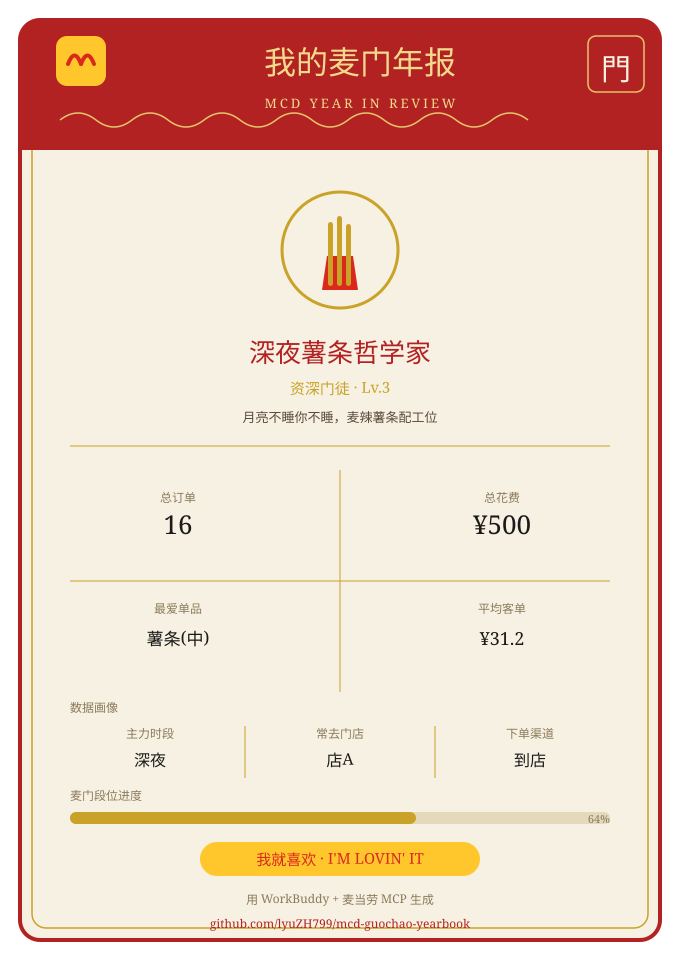

# 🍟 麦门年度人格报告 · mcd-guochao-yearbook

> 基于**麦当劳 MCP** 的历史订单，一键生成**国潮风「麦门年度人格报告」**分享卡片。
> 取数交给 MCP，算术交给代码，表达交给 Agent —— 确定性人格分类、矢量卡片离线可复现、隐私脱敏，天然适合社交传播。



---

## ✨ 特性（差异化亮点）

- **国潮视觉**：朱红 + 鎏金 + 宣纸三色体系，楷体/宋体，配麦当劳金色拱门「M」徽章与「我就喜欢 · I'M LOVIN' IT」标识，区别于清一色的极简数据卡。
- **确定性人格分类**：时段 / 品类 / 客单 / 渠道多维规则，输出稳定可复现的「人格称号 + 段位 + 专属 slogon」，同一份订单永远得到同一张卡片。
- **离线可复现**：卡片为纯 SVG 矢量生成，**零外部依赖、零位图素材**，任何人 fork 后无需联网也能用内置脱敏样例跑出完整卡片。
- **隐私脱敏**：自动剥离订单号、门店编码、BE 编码、门店名称等敏感字段，分享安全合规。
- **优雅降级**：账号无历史订单时，自动回退到积分 / 抽奖数据，或直接给出「麦门萌新」卡片，绝不报错卡死。

---

## 🎯 目标用户

- 想用一张好看卡片总结自己「麦门足迹」并分享到社交平台的麦当劳用户；
- 想借活动为仓库涨 Star 的开发者（卡片自带「用 WorkBuddy + 麦当劳 MCP 生成」与仓库链接，天然传播）。

---

## 🚀 快速开始

### 1. 安装 Skill 到 WorkBuddy

将本仓库文件夹（即 `mcd-guochao-yearbook/`）整体复制到 WorkBuddy 的技能目录：

```bash
# Windows
cp -r mcd-guochao-yearbook "%USERPROFILE%\.workbuddy\skills\mcd-guochao-yearbook"

# macOS / Linux
cp -r mcd-guochao-yearbook ~/.workbuddy/skills/mcd-guochao-yearbook
```

或在 WorkBuddy 中通过「导入技能」选择本文件夹。

### 2. 配置麦当劳 MCP

左侧边栏 →【专家·技能·连接器】→【连接器】→【自定义连接器】→【配置 MCP】，填入 `mcp-config.example.json` 的内容，并把 `YOUR_MCP_TOKEN` 替换为你在麦当劳 MCP 控制台申请的真实 Token，保存并启用 `mcd-mcp`。

> Token 仅存放在你本地的 MCP 配置中，**切勿提交到仓库**（本仓库已用占位符，且 `.gitignore` 忽略真实配置文件）。

### 3. 一句话生成

在 WorkBuddy 对话框输入：

> 「用麦门年度人格报告技能，生成我的麦门年报」

Agent 会自动调用 `order-list` → 脱敏 → 计算指标与人格 → 生成国潮 SVG 卡片，并可直接预览 / 导出 PNG。

---

## 🧩 工作原理（三段论）

| 阶段 | 负责方 | 内容 |
|---|---|---|
| 取数 | 麦当劳 MCP（`order-list` 等工具） | 拉取历史餐饮订单及商品明细 |
| 算术 | `src/analyze.py`（纯 Python） | 算总订单/总花费/平均客单/最爱单品/时段与渠道分布，确定性分类人格与段位 |
| 表达 | `src/render_card.py`（矢量模板） | 国潮风 SVG 卡片合成，含品牌标识与脱敏页脚 |

核心逻辑全部在代码中，Agent 只做编排与呈现，保证结果稳定、可审阅、可版本化。

---

## 🃏 人格分类体系（节选）

| 维度 | 判定 | 示例称号 |
|---|---|---|
| 主力时段 | 22:00–04:59 深夜 / 05:00–10:59 早安 / 11:00–13:59 正午 / 14:00–16:59 午后 / 17:00–21:59 黄昏 | 深夜薯条哲学家 |
| 品类原型 | 薯条 / 炸鸡 / 汉堡 / 辣味 / 咖啡 / 甜品 / 早餐 | 炸鸡鉴赏家、续命咖啡因 |
| 段位 | 按累计订单数：萌新→见习→资深→黄金→钻石→传奇 | 黄金门徒 · Lv.4 |

> 完整规则见 `SKILL.md` 与 `src/analyze.py` 中的 `CLASSIFY_*` 映射表，全部为确定性逻辑。

---

## 📂 目录结构

```
mcd-guochao-yearbook/
├── SKILL.md                  # WorkBuddy 技能定义（工作流 + 人格规则 + 视觉规范）
├── README.md                 # 本文件
├── CONTEST_DECLARATION.md    # 参赛声明（官方要求，内容不可改动）
├── MCP_INTEGRATION.md        # MCP 接入说明（官方要求）
├── mcp-config.example.json   # MCP 配置样例（仅占位符）
├── workbuddy.md              # WorkBuddy 开发上下文（专项奖核验）
├── src/
│   ├── analyze.py            # 指标计算 + 确定性人格分类（CLI）
│   ├── render_card.py        # 国潮风 SVG 卡片生成（CLI）
│   └── build.py              # 一键：订单 JSON → SVG
└── examples/
    ├── sample_orders.json    # 脱敏离线样例数据
    └── sample_card.svg       # 样例渲染结果（README 预览图）
```

---

## 🔒 隐私与安全

- 卡片与中间数据**不写入任何真实 Token / 密钥 / 账号凭证**；
- 渲染前对 `orderId`、`storeName`、`storeCode`、`beCode` 等字段做脱敏；
- 配置文件仅使用 `YOUR_MCP_TOKEN` 占位符。

---

## 🏆 参赛与投票（麦当劳程序员节创意开发大赛）

本仓库即为参赛项目。若你 fork 后参赛：

1. **上传 GitHub 并设为 Public**
   ```bash
   git init
   git add .
   git commit -m "feat: 麦门年度人格报告 Skill"
   # 在 GitHub 新建 Public 仓库 mcd-guochao-yearbook
   git remote add origin https://github.com/lyuZH799/mcd-guochao-yearbook.git
   git branch -M main
   git push -u origin main
   ```
2. **发 Issue 报名**（在官方仓库 [mcd-developer-innovation-challenge](https://github.com/M-China/mcd-developer-innovation-challenge) 下）
   ```
   Issue 标题：麦门年度人格报告 Skill
   Issue 正文：
   【参赛申请】
   项目名称：麦门年度人格报告
   项目地址：https://github.com/lyuZH799/mcd-guochao-yearbook
   项目简介：基于麦当劳 MCP 历史订单，生成国潮风麦门年度人格报告分享卡片。
   ```
   > 正文 ≤ 1000 字且不要带图片；项目创建时间须在 2025-12-25 ～ 2026-10-25 23:59。
3. **定榜时间**：2026-10-26 00:00（Star > 0 即进榜，前 100 名获奖）。**Star 即是选票**，欢迎点星 ⭐。

---

## 📄 许可证与免责

- 许可证：MIT（详见仓库 `LICENSE`）。
- 本项目为大赛参赛作品，非麦当劳官方产品；餐品信息、价格及供应状态以麦当劳官方渠道实时结果为准。
